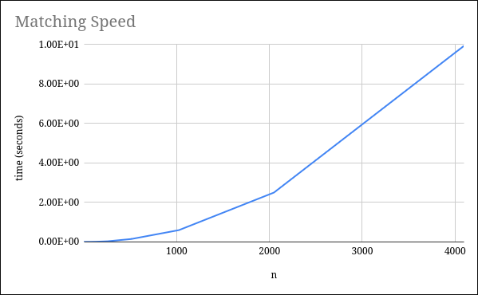
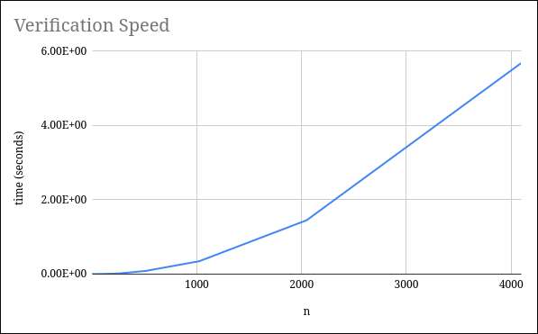

# **Stable Matching**
Implementation of Gale-Shapely algorithm involving hospital-student prefreences
## **Description**
This project implements the Gale-Shapely algorithm for solving the hospital-student assignment problem. Given preference lists from both hospitals and students, the algorithm finds a stable matching where no hospital-student pair would prefer each other over their current assignments.
The project includes three main components:
- **Matching Engine** - Implements hospital-proposing deferred acceptance
- **Verifier** - Validates that a matching is both valid and stable
- **Scalability Analysis** - Measures and graphs algorithm performance
## **Getting Started**
### **Dependencies**
- Python 3.6 or higher
### **Installing**
1. Clone Repository
## **Executing program**
- Run the matching algorithm:
  ```python src/match.py```
- Run example match
  ```python src/match.py < examples/match1.in```
- Run the verification algorithm:
  ```python src/verifier.py```
- Verify an example matching:
  ```python src/verifier.py < examples/verify1.in```
# **Help**
Ensure input files follow the correct format:
- First line: integer n
- Next n lines: hospital preference lists (permutations of 1..n)
- Next n lines: student preference lists (permutations of 1..n)
# **Examples**
Examples can be found in the examples/ folder
- match1.in -> match1.out under src/match.py
- verify1.in -> verify1.out under src/verifier.py
- verify2.in -> verify2.out under src/verifier.py
- verify3.in -> verify3.out under src/verifier.py
# **Execution Speed**
Execution speed is calculated using data collected from src/time\_match.py and src/time\_verify.py



The graphs of both matching speed and verification speed as a function of input size n appear to be quadratic with respect to n, suggesting that both matching and verification are O(n^2).
## **Authors**
- Philip Baptist
- Ansh Gupta
